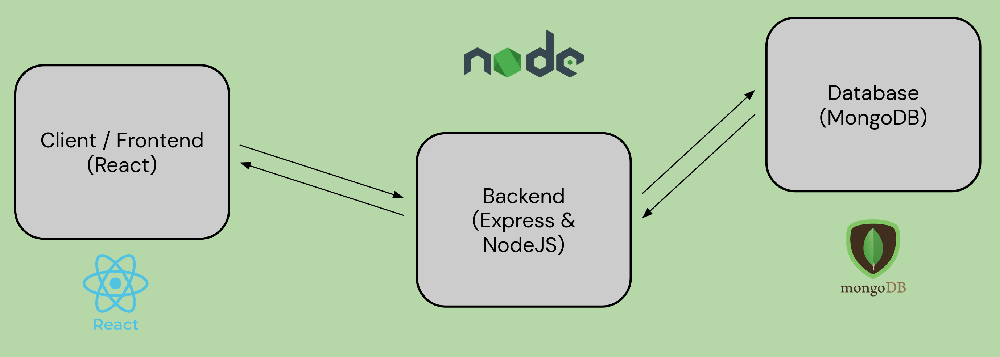

# ClubConnect
Discover clubs, connect with others - A centralized Illinois Student Organization finder.
1. Explore organizations that align with a student’s diverse interests 
2. Stay up-to-date on an organization’s recruitment and events
3. Post newly created organizations to attract new members and display updated organizational information

## Member Roles
Frontend (Login / Users) - Anya Mahajan
Frontend (Club Pages) - Andrew Mao
Backend (Organizations and organization routes) - Matt Marsico
Backend (Users and user routes) - Ethan Mathew

## Technical Architecture


## Installation & Hosting Instructions
### Dependencies
1. Install NodeJS - this depends on your platform and installation instructions can be found [here](https://nodejs.org/en/learn/getting-started/how-to-install-nodejs)
2. Install NPM (if necessary) - [installation instructions here](https://docs.npmjs.com/downloading-and-installing-node-js-and-npm)

### Frontend
1. Install NPM dependencies with
```
npm install && npm install react-scripts
```
2. Run application
```
npm run start
```

### Backend
1. Install NPM dependencies with
```
cd backend
npm install
npm install -g tsc
tsc

```
2. Setup .env file with the following variables
```
MONGODB_CONNECTION_URI = <connection_uri_here>
JWT_SECRET = <json_web_token_secret_here>
```
3. Run application - may need to configure user permissions to run on server/locally
```
npm run start
```

